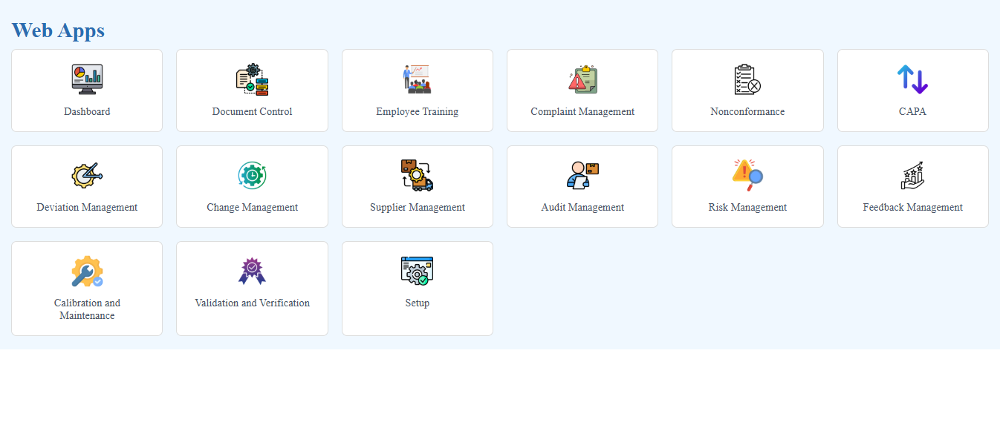

# Web Apps Navigation UI

## Overview
This project provides a web-based navigation UI for accessing various applications within an enterprise system. The interface features a user-friendly dashboard with multiple modules, each represented by an icon and a label for easy navigation.

## Features
- **Dashboard**: Provides an overview of key metrics and insights.
- **Document Control**: Manages documentation processes and workflows.
- **Employee Training**: Tracks and organizes employee training sessions.
- **Complaint Management**: Handles user complaints efficiently.
- **Nonconformance**: Manages and records nonconformance reports.
- **CAPA (Corrective and Preventive Action)**: Implements corrective and preventive measures.
- **Deviation Management**: Tracks deviations and related resolutions.
- **Change Management**: Handles and documents change requests.
- **Supplier Management**: Maintains supplier details and interactions.
- **Audit Management**: Manages internal and external audits.
- **Risk Management**: Identifies and mitigates potential risks.
- **Feedback Management**: Collects and analyzes user feedback.
- **Calibration and Maintenance**: Ensures proper calibration and maintenance of equipment.
- **Validation and Verification**: Handles compliance and validation processes.
- **Setup**: Allows system configuration and user preferences.

## Technologies Used
- HTML, CSS for front-end styling
- JavaScript for UI interactions
- React.js for component-based architecture (if applicable)

## Installation
1. Clone the repository:
   ```sh
   git clone https://github.com/your-repo/navigation-ui.git
   ```
2. Navigate to the project directory:
   ```sh
   cd navigation-ui
   ```
3. Install dependencies:
   ```sh
   npm install
   ```
4. Start the development server:
   ```sh
   npm start
   ```

## Screenshots

### 1. Home Page:
   
   
   

## Usage
- Open the browser and go to `http://localhost:3000`.
- Click on any module to access its features.
- Use the navigation to switch between modules seamlessly.

## Contributing
Contributions are welcome! Follow these steps:
1. Fork the repository.
2. Create a new branch for your feature (`git checkout -b feature-name`).
3. Commit your changes (`git commit -m 'Add new feature'`).
4. Push to your branch (`git push origin feature-name`).
5. Open a Pull Request.


## Contact
For any queries, reach out at [pachupatejay2102@gmail.com].

